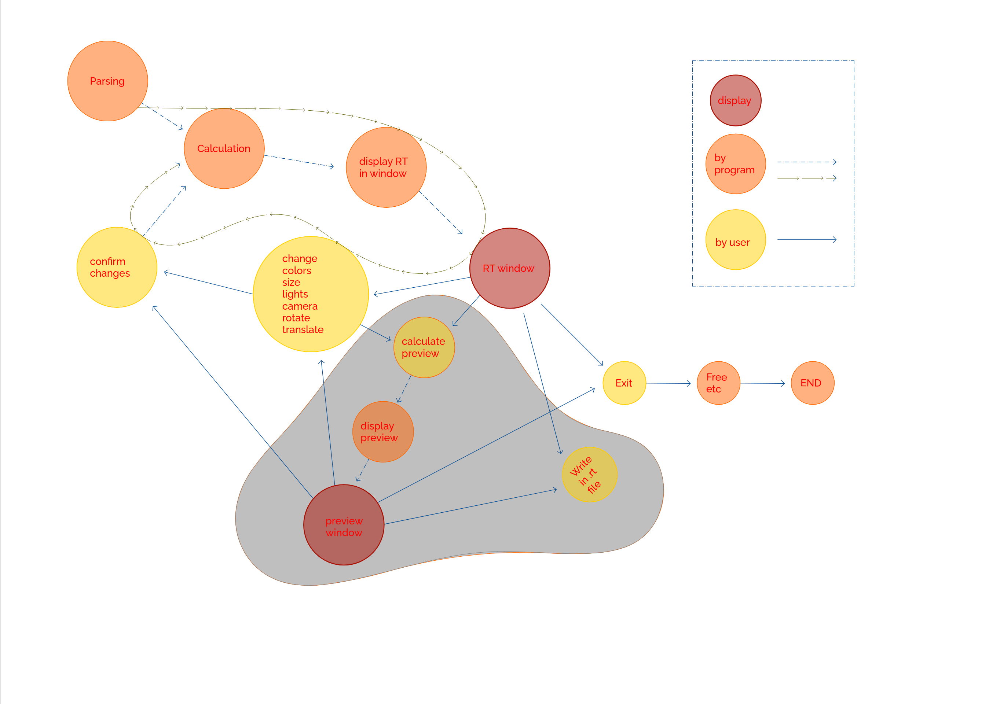
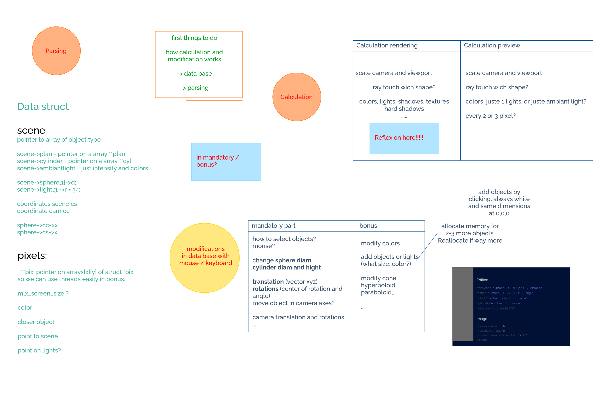
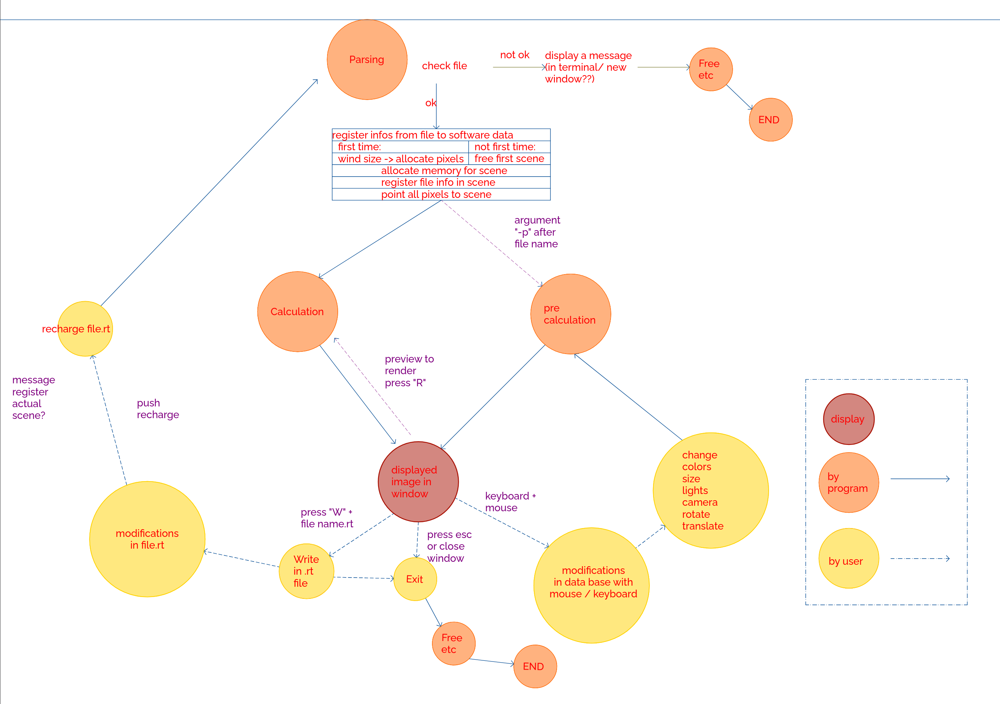
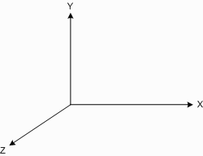

*This project has been created as part of the 42 curriculum by sforster and fatsaa-m*

# miniRT


## Description

*miniRT

Program that reads a file containing terrain data and renders a 3D wireframe representation of that landscape in a graphical window on Linux.*

**Languages & Tools:** C, MiniLibX, Math (vectors, matrices, geometry), Parsing, Data structure, Optimisation

**Skills:** 3D graphics, linear algebra, algorithmic optimization, parsing custom scene files 

### Something interesting about this project ✨

One of the most interesting projects of the 42 curriculum; it is truly amazing to see the images created from scratch.

After years of using 3D and rendering software as a designer, it was fascinating to build a renderer from scratch. A nice revenge on math, following a clear method from the book.The project was pushed as far as possible, until it could actually be used for drawing.

#### First intentions


#### Early thoughts on data structures


#### Initial project architecture


## Instruction

### Madatory part
### 🖥️ Compilation & Usage
```bash
$> make
$> ./miniRT <file.rt>.
$> ./miniRT scene/man.rt
```

`ESC` or close the window to escape

#### Window resolution
The window resolution is defined in `src/inc/minirt.h`:
```c
# define WND_WIDTH  2000
# define WND_HEIGHT 1200
```
```bash
$> make re
$> ./miniRT <file.rt>s
$> # exemple
$> ./miniRT scene/man.rt
```

#### Coordinate system


#### File.rt
```c
# ambiant lighting - ratio [0.0,1.0] - rgb color
A 0.4		255,255,255

# camera - x,y,z coordinates - orientation vector - focal
C 0,0,20	0,0,-1	40

# light - x,y,z coordinates - ratio [0.0,1.0] - rgb color
L 1,7,0		0.8

# sphere - x,y,z coordinates - diameter - rgb color
sp -2,3,1 	0.5 	250,250,250

# plane - x,y,z coordinates - normalized vector - rgb color
pl -3,0,0	1,0,0	255,150,150

# cylinder - x,y,z coordinates - normalized vector - diameter - height - rgb color
cy 0,1,4	0,1,0	2	4	150,150,150
```


### Bonus part

### Additionnal features
- Full Phong reflection model
- Reflexion (mirror)
- Transparency (also of shadows)
- Refraction
- Color disruption: patterns
- Colored and multi-spot lights
- Triangles and cones
- Handle bump map textures

### Extra additionnal features
 - Drawing / Render mode
 - Translate object
 - Rotate object
 - Scale object
 - Export a jpg image
 - Export a rt file

### 🖥️ Compilation & Usage
```bash
$> make bonus
$> ./miniRT_bonus <file.rt>
$> # exemple
$> ./miniRT_bonus scene/bonus/bubble.rt
```

`ESC` or close the window to escape

#### Coordinate system


#### File.rt
```c
# ambiant lighting - ratio [0.0,1.0] - rgb color
A 0.4		255,255,255

# camera - x,y,z coordinates - orientation vector - focal
C 0,0,28	0,0,-1	40

# light - x,y,z coordinates - ratio [0.0,1.0] - rgb color
L 1,7,0		0.8	255,255,255

# sphere - x,y,z coordinates - diameter - rgb color
sp 0,0,0 	1 	250,250,250

# plane - x,y,z coordinates - normalized vector - rgb color
pl 0,-3,0	0,1,0	255,150,150

# cylinder - x,y,z coordinates - normalized vector - diameter - height - rgb color
cy 0,2,4	0,1,0	1	2	150,230,150

# cone - x,y,z coordinates - - normalized vector - diameter - height - rgb color - ;second rgb color
co 0,-1,0 1,0.5,1 2 4 250,0,0;120,250,150

# triangle - x,y,z coordinates angle A - x,y,z coordinates angle B - x,y,z coordinates angle C - rgb color
tr 4,5,2	-4,5,2		8,4,2	152,161,168

# transparency in range [0.0,1.0]
sp -2,3,1 	0.5 	250,250,250 tran: 0.5
s
# reflexion in range [0.0,1.0]
sp 0,3,1 	0.5 	250,250,250 mir: 0.8

# refraction range [1.0,3.0]
#sp 2,3,1 	0.5 	250,250,250 ref: 1.5

# texture path/image.xpm
sp	4,4,1	2			0,0,20	txt:imgs/jupitermap.xpm

# patterns <type>|<divisions>
sp -4,1,5 2 250,70,0;0,255,100 pat:2|8 

# multiple features
sp -6,1,5 2 250,70,0;0,255,100 pat:4|8 mir:0.4
```

Pattern types:
1 - checkerboard
2 - stripes
3 - gradients
4 - rings
5 - procedural patterns based on functions such as Perlin noise

#### Drawing

On the window:
 - Enter drawing mode
 - Select an action: translate / rotate / scale
 - Select an object with the mouse
 - Select an axis: x, y, z (or u for unit scale)
 - Choose the value (number keys above the letters) and press Enter


Other features:
 - Switch render mode
 - Export a JPG or .rt file

JPG files are saved in the project root as miniRTimage.jpg (rename manually).
.rt files are saved in the project root as miniRTsave.rt (rename manually).

calcul angle cote

### Ressources

This project is mainly based on this book:
- Jamis Buck, *The Ray Tracer Challenge*, Pragmatic Bookshelf, 2019.
- Gabriel Gambetta, *Computer Graphics from scratch*, A programmer's introduction to 3D rendering, 2021.

AI doesn’t really debug. It can suggest ideas, but it doesn’t truly understand the math. A solid education, patience, and good friends are much more valuable for solving hard problems.


